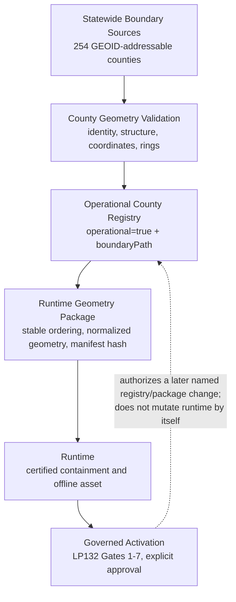

# LP137 — Texas statewide county geometry governance reconciliation

## Executive determination

LP137 is an audit-only reconciliation. The repository has a complete 254-county statewide geometry plane and a separate, certified 28-county operational runtime geometry plane. Those planes are compatible with LP130–LP136 provided that **statewide availability is not interpreted as runtime membership or activation approval**. No geometry, package, source, registry, runtime, deployment, Storage, Supabase, Edge Function, certification rule, or protected system was changed by LP137.

The current runtime package is intact and certified. Its membership is selected from the operational county registry, but the builder also enforces a fixed expected count of 28. Consequently, the registry is the substantive membership source while the fixed count is a second, implementation-era build gate. The builder does not consume an LP132 activation manifest or a Gate 7 approval record.

The architecture is deterministic for its current 28-county baseline, with one reproducibility qualification: a fresh build in this checkout is internally deterministic and produces the same geometry, bounds, statistics, and certification results, but not the committed package hash. Raw source byte length/hash metadata reflects checkout line-ending normalization for 26 sources. This is not runtime geometry drift, and LP137 did not rebuild anything, but future package expansion should resolve the provenance-byte contract before an authorized build.

## Scope and authorities

This report treats the completed milestones as distinct authorities:

| Authority | Governs | LP137 reconciliation |
| --- | --- | --- |
| County geometry foundation and tooling | Boundary source validation, registry selection, stable serialization, package manifest, containment certification | Existing mechanisms observed; no rebuild or redesign |
| LP130 | Immutable statewide address manufacturing identities | Geometry does not confer address activation; artifacts remain inputs to LP132 Gate 1 |
| LP131 | County-by-county readiness inventory | Geometry coverage closes no community, destination, crossing, certification, or runtime gap by itself |
| LP132 | Sequential Gates 1–7 and separate production approval | The only activation authority; package membership must follow, never substitute for, governed approval |
| LP133–LP135 | Certification resolution, method, and statewide baseline | Geometry certification remains separate from address certification and retains its committed result |
| LP136 | Operational-readiness control baseline | The locked runtime package, manifest, registry, and governance artifacts remain unchanged |

LP136 recommended a candidate dossier for LP137. The present milestone's supplied scope supersedes that recommendation and is narrower: geometry governance reconciliation only. It creates no candidate dossier and grants no LP132 gate result.

## 1. Statewide geometry verification

Two committed statewide FeatureCollections were inspected without rewriting them:

| Dataset | Observed contract | County identity result | SHA-256 at audit |
| --- | --- | --- | --- |
| `assets/boundaries/texas-counties-boundaries.geojson` | 254 Polygon features | 254 unique five-digit Texas GEOIDs; all `STATEFP=48`; no malformed GEOID | `a9f5a0cf44f40d4f9fae81c16756e9ad32d36b7e9d08e34e96f1f02f94f8a50d` |
| `assets/state-boundaries/Texas_Counties_Cartographic_Boundary_Map_20260620.geojson` | 254 MultiPolygon features | 254 unique five-digit Texas GEOIDs; all `statefp=48`; no malformed GEOID | `f405cdc2ff464f406feaa0bcc13df8242b4ef1e2ab0bbb00f073bfccb4244154` |

The two 254-member GEOID sets are exactly equal. GEOID, rather than feature order or display name, is the deterministic statewide identity. The compact cartographic dataset uses generic names for most features, so it must not replace the richer dataset as a naming authority; its complete GEOID set is nevertheless identity-stable.

**Finding:** authoritative statewide boundary datasets exist, represent all 254 counties, and preserve a common deterministic identity set. They are statewide source/reference assets, not evidence that 254 counties are operational and not the direct inputs selected by the current runtime package builder.

## 2. Operational runtime geometry verification

The committed runtime artifacts were checked in place:

| Artifact / assertion | Observed result |
| --- | --- |
| Package | `assets/location-resolution/gridly-authoritative-county-geometry-v1.json`, 2,756,121 bytes, SHA-256 `ba0e44fbaf1a396909f7aad98ace7d55a20f86a23ca9352c980f39116ed32461` |
| Manifest | `assets/location-resolution/gridly-authoritative-county-geometry-v1.manifest.json`, SHA-256 `7f7088e7250fca468f95edb5dd33a39bb3703e12781c9845ffe702b7d6539fe2` |
| Manifest integrity | Recorded package hash and byte length exactly match the committed package |
| Membership | 28 packaged counties; zero blocked, missing-source, or invalid-geometry entries |
| Certification | `passed: true`; Polygon, MultiPolygon, holes, and deterministic boundary handling pass; Dayton, Livingston, Houston, Pasadena, and outside-coverage controls match expected results |
| Runtime delivery | Package and manifest remain registered in the service-worker asset list; no delivery or consumer code changed |

The package and manifest are unchanged from the LP136 locked baseline. LP137 made no runtime-boundary edit, so the exact geometry bytes used by runtime are unchanged.

### Reproducibility qualification

`--verify-deterministic` builds twice in memory and passed, yielding 2,756,121 bytes and SHA-256 `be977d516d891f06d0192dc9db70cc912cb5cc52603e3e555244dd2c239793b1`. Semantic comparison against the committed package found identical geometry, bounds, geometry statistics, and certification. The byte difference is confined to source provenance metadata: 26 registered source files have normalized checkout byte lengths/hashes, while Chambers and Jefferson retain their recorded bytes. The total observed source length is 2,769,901 rather than the committed 2,770,088.

Therefore:

- **runtime integrity is PASS** because the committed manifest authenticates the committed runtime package;
- **runtime geometry equivalence is PASS** because no packaged geometry changed;
- **same-checkout deterministic generation is PASS**;
- **historical byte-for-byte rebuild reproducibility is QUALIFIED**, not failed silently, because raw source-byte metadata varies with line-ending representation.

The builder was not run in write mode. Resolving this qualification is future governed tooling work, not permission to regenerate LP137 artifacts.

## 3. How the runtime package is produced

The existing builder performs the following deterministic sequence:

1. It parses `GRIDLY_COUNTY_REGISTRY` from `js/app.js` in a bounded VM context.
2. It retains entries whose `operational` field is exactly `true` and sorts them by canonical county id.
3. It requires exactly 28 selected entries and rejects a different count.
4. For each entry it requires `boundaryPath`, reads that county-scoped GeoJSON, validates county identity when source identity properties exist, and accepts Polygon or MultiPolygon geometry only.
5. It validates rings, finite coordinates, legal longitude/latitude ranges, ring closure, bounds, and geometry structure; coordinates are normalized to seven decimal places.
6. It records source path, raw-byte SHA-256 and byte length, normalized geometry, bounds, and statistics.
7. It runs deterministic point-in-polygon certification, including polygon, multipolygon, hole, boundary, and known-location controls.
8. It stable-sorts object keys, uses a fixed generated timestamp and package version, emits the package and manifest, and verifies package hash, byte length, member count, and zero blocked counties.

### Membership governance answer

Current membership is governed by **two combined mechanisms**:

- **Operational registry (primary selection):** `GRIDLY_COUNTY_REGISTRY` entries with `operational: true` supply the county ids and boundary paths.
- **Fixed implementation count (secondary hard gate):** `EXPECTED_COUNT = 28` prevents output unless selection has exactly 28 members.

It is **not** governed directly by an LP132 activation manifest. The builder does not inspect Gate 1–7 evidence, an approval ledger, runtime-manifest candidates, or package registries. Thus “in the operational registry” is presently necessary for package membership, while “exactly 28” is necessary for the build to complete. Neither fact independently proves that a future county received LP132 approval.

## 4. Authoritative architecture reconciliation

The solid path is the required evidence lineage: statewide sources make county geometry available; validation makes a county geometry candidate credible; operational registry membership selects runtime inputs; packaging makes them deterministic and certifiable; runtime consumes the committed bytes; LP132 governance determines whether use may advance to production. The dashed feedback edge makes the control direction explicit: for a **future** county, Gate 7 approval and its separate change record must authorize a later registry/package change. Merely reaching the runtime/package layers cannot grant activation.

### Alignment with LP132

- Gate 1 locks artifact identity. Geometry source, built package, manifest hash, and county/FIPS identity belong in that immutable dossier.
- Gate 2 address certification is not replaced by geometry certification.
- Gates 3–5 remain independent community, destination, and crossing obligations; statewide boundary coverage cannot satisfy them.
- Gate 6 validates the exact proposed runtime composition and consumer behavior outside production, including containment and failure behavior.
- Gate 7 supplies explicit, time-bounded approval. A later implementation may then change the named operational registry membership and package under its own reviewed change record.
- `FAIL` or `NOT RUN` at any gate leaves registry and package membership unchanged. No automatic promotion follows from statewide geometry availability.

This ordering reconciles the apparent circularity between “runtime” and “activation”: current runtime is the stable Wave 0/control baseline used in Gate 6; governed approval authorizes a future runtime change, never retroactively blesses an ungoverned one.

## 5. Runtime package governance assessment

| Question | Assessment |
| --- | --- |
| Is current package selection deterministic? | Yes: exact registry predicate plus lexical county-id ordering. |
| Is its committed integrity certified? | Yes: manifest hash/length match, 28 members, certification PASS. |
| Does membership encode activation evidence? | No: it encodes current operational state but does not carry or validate LP132 approvals. |
| Does fixed count improve current safety? | Yes: it detects accidental additions/removals against the 28-county baseline. |
| Can fixed count govern statewide growth? | No: every legitimate 29th or later member fails until code is edited, and a changed number supplies no evidence that named counties passed LP132. |
| Is an activation manifest currently the builder authority? | No. Candidate runtime manifests elsewhere in the repository are manufacturing outputs and are not consumed here. |
| Is regeneration required now? | No. The committed package is intact and runtime boundaries are unchanged. |

The fixed count is a useful **baseline assertion**, not a durable activation policy. Treating it as approval would conflate cardinality with identity and evidence. Conversely, removing it without replacing its regression function would weaken accidental-change protection.

## 6. Future scalability assessment

Future activation **should expand runtime geometry through an approved operational registry**, not through a fixed expected county count. “Approved” must mean a deterministic, reviewable set derived from named LP132 Gate 7 decisions and bound to county/FIPS, source geometry identity, package identity, approval/change-record identity, and effective status.

The scalable target contract should retain all existing determinism:

1. Fail closed unless every proposed registry member has a current approval reference and validated county geometry identity.
2. Select exact approved county ids, never “the first N” or “any N operational counties.”
3. Sort by canonical county id and retain stable serialization, normalized coordinates, source provenance, containment certification, and manifest hashing.
4. Compare the exact approved set with the exact operational registry set and fail on missing, extra, duplicate, expired, or mismatched identities.
5. Record expected membership as a hashed/signed set or approval snapshot; report count as a derived invariant rather than the authorization input.
6. Preserve the current committed package until a separately authorized activation implementation changes it.

This is an architectural recommendation only. LP137 neither defines a new manifest schema nor changes the builder.

## 7. Reconciliation with LP130–LP136

- **LP130:** all 254 address candidates can be joined to statewide geometry by stable Texas GEOID, but geometry availability does not alter immutable address packages.
- **LP131:** statewide boundaries support auditing all counties; the 28-member runtime geometry package does not erase LP131 readiness gaps.
- **LP132:** sequential approval is the policy authority. Registry/package membership must be a controlled output of approval, not a shortcut around it.
- **LP133–LP135:** address certification status remains authoritative and independent; the runtime geometry package's own containment certificate remains valid.
- **LP136:** the locked runtime control artifacts are byte-unchanged, and operational readiness remains a prerequisite posture rather than deployment permission.

The result is one deterministic system with deliberately separate scopes: **254-county source availability**, **validated county geometry**, **approved operational selection**, **hashed runtime packaging**, and **governed production use**.

## 8. Risks and controls

| Risk | Current disposition | Required future control |
| --- | --- | --- |
| Statewide geometry mistaken for activation | Controlled by this reconciliation and LP132 | Keep geometry/readiness/approval statuses separate in every dossier |
| Operational flag added without Gate 7 authority | Builder cannot detect this | Validate registry membership against an approval snapshot before any future build |
| Fixed count blocks a legitimate expansion | Latent; no LP137 build attempted | Replace cardinality authorization with exact approved-set validation in separately scoped work |
| Fixed count removed without regression replacement | Latent | Preserve explicit set-diff, duplicate, missing, and unexpected-member checks |
| Source line endings change provenance hashes | Observed reproducibility qualification; runtime unaffected | Define canonical-byte hashing or enforce byte-preserving checkout before the next authorized package build |
| Statewide reference naming used as identity authority | Compact source contains generic names | Join and govern by five-digit Texas GEOID; use separately governed canonical names |

## 9. LP138 recommendation

LP138 should be an **audit/design milestone for an approval-bound operational geometry membership contract**, not a package build or activation milestone. It should:

1. inventory the exact Gate 7 approval/change-record fields needed to authorize registry membership;
2. specify a deterministic approved-set snapshot keyed by county FIPS and canonical runtime county id;
3. specify set equality checks between approval snapshot, operational registry, boundary source identities, and proposed package membership;
4. decide and certify a platform-independent source provenance hash contract, explicitly addressing line endings;
5. preserve the current 28-county package as the unchanged control and demonstrate proposed checks in read-only mode;
6. produce an implementation authorization recommendation only—no builder edit, geometry regeneration, activation, deployment, or protected-system change.

Only a later separately authorized milestone should implement the contract and rebuild a package for specifically approved counties.

## 10. Success and non-modification statement

LP137 succeeds as a governance reconciliation with the following recorded outcome:

- statewide boundary coverage: **PASS (254/254, two matching GEOID sets)**;
- deterministic statewide identity: **PASS (254 unique valid Texas GEOIDs)**;
- committed runtime package integrity/certification: **PASS**;
- runtime geometry unchanged: **PASS**;
- same-checkout deterministic builder behavior: **PASS**;
- historical build-byte reproducibility: **QUALIFIED (source provenance line endings; geometry equal)**;
- activation-governance alignment: **PASS, with builder-to-approval binding recommended for LP138**;
- geometry/package/source regeneration: **NOT PERFORMED**;
- activation, runtime, deployment, Storage, Supabase, Edge Function, and protected-system changes: **NOT PERFORMED**.

The only intended repository change is this report.
