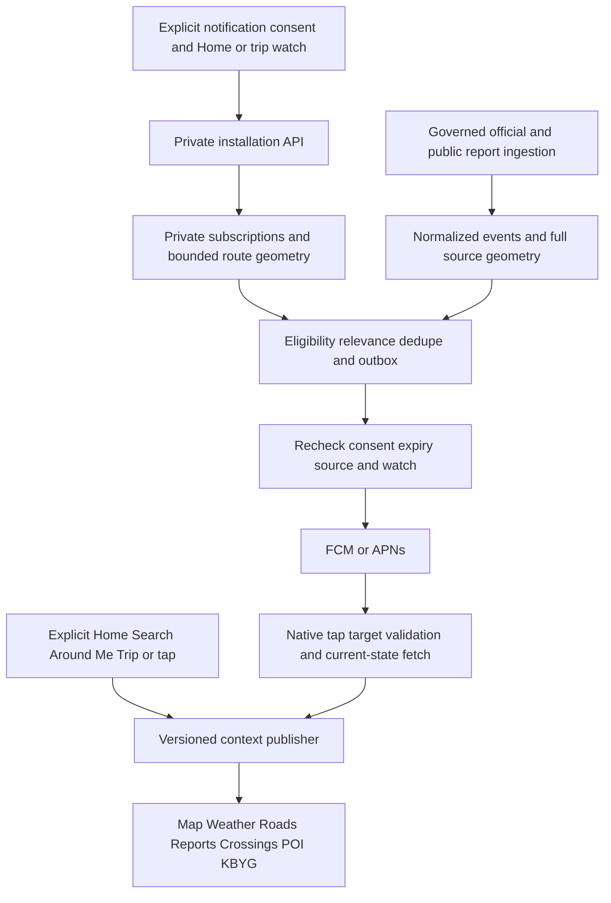

# LP244.44 — Travel awareness and notification architecture freeze

Planning only, `LP24444.v1`, baseline `0b8a5914cf69dcbc9f658b860d8d8cd9a2f57467`, branch `LP244.44-travel-awareness-notifications-implementation-plan`. The runtime has **not** acquired these capabilities in this phase. “Frozen” means a precise next implementation contract; production service access, capacity, signed candidates, legal/store review and physical certification remain separate gates.

Gridly is **Know Before You Go: awareness first, route intelligence second**. Useful at Home, in a searched community, around the current foreground position and on an explicitly watched trip. No mandatory accounts, turn instructions, automatic rerouting, navigation ETA, emergency routing, live train detection or continuous background location/history. Portrait remains authoritative. Native notifications, complete winter minimum and physical Android/iPhone certification are MUST HAVE.

## ARCH-01 — Contract authority and index

Owner instructions govern product intent. LP244.44 supersedes LP244.43 recommendations; LP244.43 remains historical evidence. [Launch contracts JSON](../../reports/lp24444-launch-contracts.json) owns enumerations and numeric defaults; named documents own algorithms, validation and bounded exceptions. Any later change to a frozen default must update machine and prose contracts together with fixtures; no client/server divergent constants.

| Contract | Responsibility |
|---|---|
| [Awareness context](LP24444-AWARENESS-CONTEXT-CONTRACT.md) | Exact payload, single visible owner, Quick Check, Around Me, Home invariants |
| [Route relevance](LP24444-ROUTE-WATCH-RELEVANCE-CONTRACT.md) | Lifecycle/TTL, real geometry, progress, weather/road/crossing relevance and wording |
| [Backend](LP24444-NOTIFICATION-BACKEND-CONTRACT.md) | Anonymous ownership/API/tables/security, normalized event, priority/dedupe/outbox/deletion |
| [Deep links](LP24444-NOTIFICATION-DEEP-LINK-CONTRACT.md) | Bounded v1 target union, cold/warm hydration, offline/expired/invalid outcomes |
| [Hazard normalization](LP24444-HAZARD-NORMALIZATION-CONTRACT.md) | Independent dimensions, aliases, advisory authority, legacy/source compatibility |
| [Winter](LP24444-WINTER-HAZARD-CONTRACT.md) | All eight concepts, source/marker/KBYG/push/route acceptance |
| [Native push](LP24444-NATIVE-PUSH-PLAN.md) | Android/iOS requirements, provider boundary, consent/settings/quiet hours |
| [Physical acceptance](LP24444-PHYSICAL-DEVICE-ACCEPTANCE.md) | Hard P01–P26 Android/iPhone gates and evidence packet |
| [Implementation phases](LP24444-IMPLEMENTATION-PHASES.md) | LP244.45–53 dependencies, bounded branches, acceptance/rollback and scope |
| [External decisions](../../reports/lp24444-external-dependency-register.json) | Capacity/credentials/owner/engineering/device actions and release blockers |

## ARCH-02 — Frozen choices and supersession

| Topic | Decision |
|---|---|
| Visible context | Last explicit valid selection wins HOME/SEARCH/AROUND_ME/ROUTE_WATCH; NONE is explicit absence. Bootstrap restores Home once; no hidden fallback afterward |
| Home | Canonical PLACE/governed locality persists only through explicit Home chooser; Search/POI/GPS/taps cannot rewrite it |
| Around Me | Option A foreground only; memory-only location, original-fix 120s freshness; no server near-me push/geofence |
| Destination | Quick Check MUST HAVE; explicit persistent destination watch SHOULD HAVE, unsupported by v1 server API until a separate bounded contract |
| Route background | Static known corridor until fixed expiry, no server progress upload/permanent JavaScript |
| Watch lifetime | Internal duration-based 1h minimum/12h maximum formula `min(12h,max(1h,2*duration+30min))`, otherwise4h; pause/restart cannot extend |
| Ahead wording | Foreground <=30s fix, <=50m accuracy, two consistent samples, unique projection/uncertainty checks; whole miles only. Background never numeric ahead |
| Routing | OSRM-compatible real geometry through bounded future server boundary; capacity/terms review mandatory, self-host/approved host if public capacity inadequate; no straight-line fallback |
| Native delivery | Android FCM, iOS direct APNs, small internal server adapter; no Web Push primary dependency or commercial broker required |
| Identity | Anonymous server UUID plus separate client-generated 256-bit secret, private native storage and verified token binding; no Supabase account requirement |
| Priority | HIGH_AWARENESS and ROUTINE only, no OS Critical Alerts/emergency authority |
| Settings | Master off; explicit opt-in, Home/Route contexts and severe/significant content on after confirmation; community/routine off; quiet hours available but off, high bypass off |
| Dedupe | Installation + canonical event + material revision, independent of context; TTL/revocation recheck before send |
| Hazard | Condition/severity/advisory/authority/confidence/lifecycle/geometry independent; SEVERE is upper severity, UPDATED is change rather than lifecycle |
| Winter | All eight requested concepts in launch; compact subtypes/observed impact, distinct ice marker and full display compatibility |

This explicitly tightens LP244.43: winter subtypes no longer optional; static Route Watch notifications are MUST HAVE; quiet hours are a launch control; severity uses SEVERE rather than CRITICAL proposals; precise progress defaults replace tentative broader freshness/distance suggestions. Existing 0.8mi discovery, 750ft preview and 60m shadow tolerance are evidence, not interchangeable high-relevance proofs. Foreground Around Me is not silently upgraded to background watch.

## ARCH-03 — Data and control flow

Context publication controls visible scope; subscriptions control delivery independently. Home remains Cleveland while Crosby Search updates every visible family and Home subscription still matches Cleveland. Around Me in Beaumont uses ephemeral current coordinates and labels unresolved locality rather than borrowing Cleveland. An active route continues static-corridor matching while Search is visible, until explicit stop/pause/expiry. A push tap is a temporary inspection action, not subscription consent.

Local Route Watch without push consent remains useful foreground awareness with the same bounded state/geometry rules and “Trip alerts off”; it creates no server subscription. Its geometry remains memory-only, so process restart cannot reconstruct a private route unless a valid explicitly consented server watch exists; show reconnect/reconfigure rather than invent persistence. Local state uses session UUID separate from server-owned watch ID until explicit server activation; no payload may submit a local ID as proof of server ownership. On later enablement, require explicit watch activation with a new accepted server ID/expiry.

No upstream coordinates in push payload/lock-screen text. Route geometry is sensitive private trip data, not an anonymous public road layer. Home subscription stores governed locality, not residence address. Existing reporting identity/database remain separate from new installation credentials. Existing active public report reads need explicit selected-context filtering during future integration; they are not already GPS-scoped queries.

## ARCH-04 — Degraded-mode behavior

| Failure / change | Consumer contract | Server/delivery contract |
|---|---|---|
| Location denied/revoked | Say denied, offer Search/Return Home; no repeated automatic prompts | No new current-position authority; static explicitly active watch may remain |
| Location stale/unavailable/timeout | Distinguish causes; original timestamp controls age; Refresh location | Never manufacture moving progress; Around Me no background subscription |
| PLACE resolution fails | Coordinate/uncertainty awareness if valid; missing locality explicit | No guessed PLACE subscription |
| Push permission denied | OS status distinct from Gridly master; explicit system-settings action | No new opted-in ready delivery; ordinary local awareness remains useful |
| Registration fails/probe expires | Pending/failed, manual bounded Retry | No unverified token active, no fake readiness |
| OS notifications disabled later | Requery on resume, pending sync truthful; no promise immediate server knowledge | Suppress once learned; OS controls presentation independently |
| Route service unavailable | Cannot start new trip; Quick Check usable; no straight-line corridor | Existing valid static watch only to original expiry |
| Route geometry unavailable | No route relation/ahead copy; reconnect/reconfigure | No route enqueue without valid geometry |
| NWS unavailable/partial | Weather/alerts dated or unavailable; other sources independent | Source freshness deadline stops new weather sends, no all-clear/cancel from fetch failure |
| DriveTexas unavailable/partial | Road source unavailable, community stays attributed | No new stale roadway send; no inferred reopening |
| Supabase unavailable | Local governed data/cache only with labels; subscription mutations pending | No falsely confirmed enrollment/stop/delete; retry idempotently |
| Offline app | Cached data explicitly dated, local GPS where supported, controls pending remote confirmation | Server may continue prior consented static watches to expiry; cannot recall queued provider messages |
| Expired/deleted deep-link target | Ended/unavailable explanation, safe explicit choices | Refetch current truth; no resurrection from message body |
| Home available, Around Me unavailable | Keep Around Me unavailable label; Return Home is user action | Home subscription remains independent, never presented as current area |
| Source/organization authority withdrawn | Remove public projection and active claim | Cancel unsent matches; do not preserve source authority from old cache |

Unknown is not zero hazards. No “all clear”, “safe road”, “fastest route” or guaranteed notification promise from missing data. Source health is per family and visible in brief/detail. A blocked exact-road claim may still yield qualified regional awareness only when evidence supports it.

## ARCH-05 — Privacy and future disclosure checklist

Around Me/Search have no persisted coordinate history. Current fixes are memory-only and cleared on exit/expiry; providers receive coordinates only when needed for the active explicit request. Do not append them to existing movement/commute keys. Native ownership secrets/tokens never go into browser storage, URLs, public tables or logs. Token binding, trip geometry, prefs and ledgers are private. Delete immediately revokes delivery/ownership and purges identifying subsystem data within15min; retained nonidentifying operational counts cannot reconstruct a person/trip. Backup expiration/access is subject to owner/legal review; any restored notification subsystem is isolated and all installation-owned state purged before access/workers resume, requiring explicit reenrollment. No identifying deletion journal is retained and no claim is made that immediate row deletion erases backups. See backend contract for bounded engineering maxima and pending-offline deletion.

This is an implementation checklist for future owner/legal/store review, **not legal advice or changed legal text**:

| Surface | Required future review/change before activation |
|---|---|
| Privacy Policy | Anonymous installation credential/identifier, provider token, Home locality, explicit route endpoints/geometry, purposes/recipients, provider handling, logs/backups, engineering retention and deletion limits |
| Terms | Awareness/best-effort freshness/delivery, observational vs official sources, nonnavigation and no emergency-routing/live-train assurance |
| Delete Data | No-login authenticated in-app deletion, offline pending vs completed, lost credential/reinstall support, precise subsystem scope, backup cleanup and confirmation |
| Community Guidelines | Observational winter/passability language, no self-authorized closures, misuse/moderation/independent confirmations |
| Google Play Data Safety | Inventory actual collection/transmission/storage/third-party SDK behavior; classify identifiers/location/diagnostics and deletion without guessing answers before implementation |
| Apple privacy disclosures | Actual linked/unlinked data purposes, provider SDK practices/manifests as applicable, precise/coarse location and installation data; owner validates against shipped binary |
| Android notification rationale | Value before OS prompt, contexts/content/channels, best effort and no DND privilege |
| iOS notification rationale | Value before permission; ordinary visible alerts, no Critical Alerts or silent-delivery guarantee |
| Location permission descriptions | Explicit foreground Around Me/route refinement purpose, approximate/denied alternative, no background movement tracking claim |
| Route/location retention disclosure | Static private trip geometry/immutable expiry/terminal purge, no continuous history, provider transmission, backups and deletion failure handling |

Do not amend policy/store answers solely from this plan. Final statements must match implemented/verified data flows. Existing public-site, gridlygo.com and Dispatch are untouched.

## ARCH-06 — Evidence, changes and validation boundary

LP244.43 [capability inventory](../../reports/lp24443-current-capability-inventory.json) scanned 6,321 text files of 6,664 tracked paths (343 exclusions). Its [validation](../../reports/lp24443-audit-validation.json) records 91/92 existing tests passing with one historical LP165 protected-hash drift. We preserve those artifacts and do not represent existing test evidence as new native certification.

| Evidence anchors at frozen baseline | Implication for future work |
|---|---|
| js/app.js:18600/18667/18681; 102415 | Home persistence/canonical multi-county identity exist; keep storage governance |
| js/app.js:46335/48524/48555 | Search marker is temporary but awareness/weather remain Home-oriented; unified context is new integration |
| js/app.js:54444/54738/54773/87497/87512 | Browser location and Android report plugin differ; original fix timestamp/provider parity need work |
| js/app.js:19558/99240/99316/101410/101524 | OSRM/trip foundations exist; public capacity and entry parity not certified |
| js/app.js:45501/45517/45648/62124/105121 | Current vertex/proximity heuristics do not prove signed precise moving relevance |
| js/gridlyWeatherProvider.js:196; DriveTexas full-geometry evidence in LP244.43 | NWS normalization drops polygon; route-wide official catalog and complete geometry are future requirements |
| js/app.js:10178/10252/12256/12311/106668 | Ice model/picker/marker/display inconsistent; correction must cover every projection |
| js/app.js:101633/105212/105333/120392 | Preferences/candidate diagnostics exist, delivery disabled/coming soon; native delivery remains net-new |
| LP244.43 native/backend/privacy inventory | No audited push queue/credentials/config/entitlements; existing report retention and local movement keys aren't notification infrastructure |

Coverage follows the named contracts: context/Quick Check/Around Me→CTX-01–06; route/expiry/routing/progress/source truth→ROUTE/REL/GEO; installation/API/schema/event/dedupe/deletion→ID/API/DB/EVT/SEND/SEC; target states→LINK; Android/iOS/permission/settings→NATIVE/ANDROID/IOS/UX; dimensions/authority/lifecycle→HAZ/AUTH/ADV/LIFE; all winter→WIN; device gates→CERT; exact future branches/scope→PHASE; all external dependencies and disclosure surfaces→register/ARCH-05. Each MUST scope item has a future owning phase and physical acceptance rows.

LP244.44 validation checks JSON structure/enums/defaults, all ten documents and local references, winter8/target7/context separation, phase acyclicity, evidence anchors and exact planning-only file allowlist. Manual review checks no unsupported current capability/authority/navigation/background claims. `git diff --check` is required. Results: [plan validation report](../../reports/lp24444-plan-validation.json). No runtime/native/source/legal/website/Dispatch file may change; no production query/mutation, new migration/plugin/credentials, candidate build, push/merge/deploy is allowed.

## ARCH-07 — Remaining owner gates and verdict meaning

No unresolved product choice prevents starting LP244.45: foreground Around Me, static background route, complete winter, identity/TTL/settings/dedupe/security and phase order are frozen. Remaining owner actions are concrete external release gates: routing/geocoding/source capacity and budgets; Firebase/Apple access and signing/Mac/devices; Supabase workload/operations; retention/backups and legal/store disclosure approval. Secure-store library choice is an engineering dependency under the frozen security contract. Dispatch public capability is required only if a later integration is proposed, not to launch the listed public-source features.

READY FOR IMPLEMENTATION means this planning package is complete. It does not mean runtime readiness, approved costs, production authority or physical launch certification. Work continues only in the bounded subsequent phases requested by the owner.
